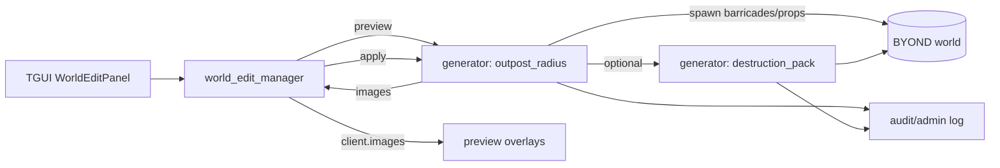
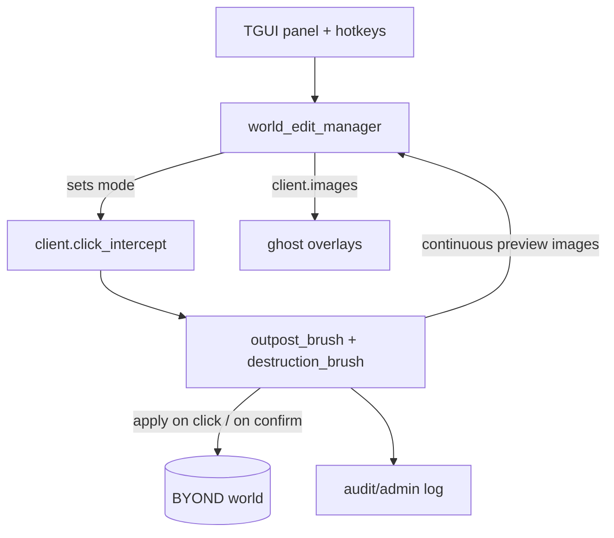

# GM‑инструменты для аванпостов по радиусу и управляемой деструкции в BandaTroopers

## Краткое резюме

Включённые коннекторы: **github** (единственный включённый по условиям задачи).

Проект BandaTroopers — форк CM‑SS13‑PVE, сделанный на entity["company","BYOND","game engine platform"] и использующий модель entity["video_game","Space Station 13","byond ss13 classic"]; сборка “только BYOND” официально помечена как недостаточная — требуется отдельный build‑tool, а новые интерфейсы рекомендуются через tgui. citeturn17view2

Для задачи “ГМ быстро создает аванпост в радиусе + накатывает управляемое разрушение (разлёт пропов, мусор/дебрис, огонь, который невозможно потушить игрокам)” наиболее рационально использовать уже существующий каркас **world_edit** из ветки `PhantornRU/BandaTroopersFork:world_edit` (как модпак) и расширять его двумя направлениями:

- **Новый генератор “Outpost‑in‑Radius”**: строит укрепления/декор по радиусу/периметру, автоматически задаёт ориентацию (DIR) баррикад “наружу/внутрь/по касательной”, имеет превью (overlay) и безопасные лимиты.
- **Пакет деструкции** поверх радиуса: “scatter/shuffle”, спавн дебриса из whitelist‑палитры, управляемый урон, огонь “unsuppressible” (не тушится обычными способами), с административным “cleanup”.

Ключевые инженерные риски/ограничения (и как их закрывать):

- Операции по радиусу могут быть тяжёлыми для тиков/клиента (особенно превью через `client.images`), поэтому нужны **лимиты**, “двойное подтверждение” для опасных режимов, и **редактируемая зона** (editing area) по аналогии Zeus. citeturn20search1turn14search0  
- “Undo” для разрушений и огня (и для побочных эффектов) сложно сделать полностью корректным — даже WorldEdit предупреждает, что история не захватывает косвенные эффекты (например, распространение огня/жидкостей). citeturn16search0  
- В модпаке `world_edit` (ветка) присутствует проблемный паттерн — **override `add_admin_verbs()`**. При интеграции в апстрим BandaTroopers это нужно заменить на “регистрацию верба” через существующие глобальные списки вербов (без override), чтобы не ломать текущую систему админ‑прав. (Ниже — явный шаг миграции.)

Предположения/неуточнённые элементы: платформа и окружение хостинга не заданы; в отчёте предполагается **PC multiplayer**. Долговременное сохранение изменений карты между раундами — **не подтверждено** по доступным публичным источникам, и рассматривается как “опциональная инфраструктура” (вариант C).

## Базовая архитектура BandaTroopers и world_edit

### Движок, модель сущностей и сеть

BandaTroopers (как форк CM‑SS13‑PVE) строится на BYOND и DM, где мир состоит из `area`/`turf`/`obj`/`mob`, наследующихся от `/atom`. citeturn17view2turn19search0 Это означает:

- “Создать аванпост” в терминах движка — это **создать/удалить/переместить атомы** на определённых `turf` (и/или заменить `turf`).
- Серверная авторитетность и синхронизация в мультиплеере — стандартная модель DM (мультиплеерные “сетевые миры” прямо заявлены в описании DM). citeturn15search0

Нечётко/не задано: точный профиль производительности (tick_lag/fps, серверные лимиты), наличие отдельной подсистемы “персистентного мира”, политика логирования действий ГМа (частично есть административное логирование через manager, но глубина не подтверждена публичной выборкой).

### Карты, шаблоны и “префабы”

По корню репозитория видно наличие `maps/`, `map_config/` и `SpacemanDMM.toml`, что типично для SS13‑проектов с DMM‑картами и линтером/валидатором SpacemanDMM. citeturn17view2turn17view1

Внутри кода (по обследованию репозиториев через GitHub‑коннектор) ключевые API и файлы для “штамповки” структур и радиусных эффектов выглядят так (пути **точные**, содержимое проверено коннектором; строчные line‑цитаты GitHub‑файлов недоступны из‑за ограничений web‑кэша на странице файлов, поэтому ниже — ссылка‑перечень в конце отчёта):

**BandaTroopers (apстрим):**
- `code/modules/mapping/map_template.dm` — `/datum/map_template`: `get_affected_turfs()`, `load(turf, centered, delete)`.
- `code/controllers/subsystem/mapping.dm` — `SSmapping.map_templates`: pre‑load шаблонов (как минимум из `maps/templates/`).
- `code/modules/admin/verbs/map_template_loadverb.dm` — админ‑верб размещения map‑template с превью через overlay.
- `code/modules/mapping/reader.dm` и смежные файлы — загрузка/парсинг карты (DMM/TGM) и опция “delete contents” перед загрузкой (важно для destructive‑режимов).

**Fork `PhantornRU/...:world_edit` (модпак):**
- `modular/world_edit/code/core/world_edit_registry.dm` — реестр генераторов (каталог, категории, права, режим click/batch).
- `modular/world_edit/code/core/world_edit_types.dm` — типы/контракты генераторов и параметров.
- `modular/world_edit/code/core/manager/world_edit_manager_*.dm` — менеджер сессии (UI, preview/apply, click mode).
- `modular/world_edit/code/generators/world_edit_generator_barricade_builder.dm` — размещение баррикад (point/line/rect), ориентация auto/fixed, click‑режим.
- `modular/world_edit/code/generators/world_edit_generator_structure_chunk.dm` — вставка map_template как “chunk prefab” (centered/delete).
- `modular/world_edit/code/generators/world_edit_generator_chaos_demolition.dm` — “разрушение/хаос” по радиусу: shuffle/scatter, опциональные взрывы/огонь, лимиты и подтверждения.
- `modular/world_edit/code/effects/world_edit_persistent_fire.dm` — эффект “настойчивого огня”.
- `tgui/packages/tgui/interfaces/WorldEditPanel.tsx` — TGUI‑панель управления генераторами.

### Перехват клика и превью‑оверы

Ключевой механизм превью для ГМа в BYOND — это `image()` + список `client.images`. В официальной справке DM: `client.images` — список изображений, показываемых пользователю; добавление/удаление делается через `+=`/`-=` или через `usr << image`. citeturn20search1turn20search2

Это напрямую подходит под “ghost/preview” без влияния на мир:

- Превью “кольца аванпоста” = набор `image` на соответствующих `turf`.
- Превью “ориентации” = стрелочный overlay, выставленный с `dir` (в DM `dir` — стандартная переменная `/atom`, влияющая на направление и на выбор ориентации спрайта). citeturn19search1

Перехват кликов (на что опираются click‑генераторы) логически строится на переопределении/редиректе click‑обработчика. Концепция `Click(location, control, params)` и наличие `params` (модификаторы мыши/клавиатуры) описаны в справке DM. citeturn20search0  
В SS13‑подобных кодовых базах очень типичен паттерн: `client.click_intercept` хранит datum с `InterceptClickOn()`, который “перекладывает” стандартный клик на инструмент — это полностью согласуется с BYOND‑моделью событий.

### Направленные блокеры и ориентация укреплений

В BYOND направление объекта задаётся `dir`, возможные значения — `NORTH/SOUTH/EAST/WEST` и диагонали; значение влияет на “какой кадр спрайта рисовать”. citeturn19search1

В BandaTroopers направленные “блокеры” представлены баррикадами и родственными структурами (по обследованию кода — `code/game/objects/structures/barricade/barricade.dm` и `.../sandbags.dm`):

- Баррикады — объекты на границе тайла (типичный SS13‑паттерн `ON_BORDER`) и используют `dir` как часть логики “какое направление перекрыто” (внутренние методы вида “BlockedExitDirs/BlockedPassDirs”).
- Песочные мешки и/или другие баррикады могут иметь визуальную коррекцию (pixel‑offset) в зависимости от `dir`, поэтому **автоповорот должен быть консистентен** (например, “наружу” из радиуса = всегда одна и та же нормаль относительно центра).

Из-за отсутствия line‑цитирования GitHub‑файлов в web‑кэше эти детали верифицированы коннектором и требуют локального просмотра файлов по ссылкам из раздела “Ссылки” для точной строки; ключевой вывод — ориентироваться надо на `dir` и на уже существующий тип баррикад, а не придумывать собственный “направленный коллайдер”.

## Паттерны из WorldEdit, Zeus и Garry's Mod применительно к радиусным аванпостам и разрушению

image_group{"layout":"carousel","aspect_ratio":"16:9","query":["WorldEdit brush sphere cylinder screenshot","Arma 3 Zeus curator editing area circle screenshot","Garry's Mod toolgun ghost entity preview screenshot","Garry's Mod physgun rotate snap angles screenshot"],"num_per_query":1}

### WorldEdit

WorldEdit строится вокруг “сессии пользователя”, где каждая операция попадает в историю; по умолчанию хранится ограниченное число последних действий, доступно `//undo`/`//redo`. citeturn16search0 Важнейшее предупреждение: история фиксирует **только прямые изменения**, а косвенные эффекты (например, распространение огня/жидкостей, “отваливание” зависимых блоков) не гарантируются к откату. citeturn16search0

Кроме пользовательской документации, в API WorldEdit есть выделенная модель “изменения” (`Change`) с методами `undo()` и `redo()` — полезная архитектурная подсказка, как проектировать минимальный дифф для отката в BandaTroopers (созданные объекты, перемещения, удаления). citeturn16search6

Переносимые выводы для BandaTroopers:
- Для деструкции (взрывы + огонь + дебрис) “полный undo” дорог/часто невозможен → **нужно проектировать ограничения**: либо частичный undo, либо запрет undo для разрушительных режимов, либо snapshot‑подход (вариант C).
- Сессионная история в UI world_edit стоит расширять до “ChangeSet‑лайт”.

### Arma 3 Zeus/Curator

В Zeus ключевой охранный механизм — **editing areas**, которые являются кругами (позиция + радиус) и определяют, где куратор может размещать/редактировать/удалять сущности. citeturn14search0turn14search2 Также подчёркивается возможность иметь **несколько кураторов** с разными настройками/доступом. citeturn14search0

Переносимые выводы:
- Для GM‑инструмента “авангард по радиусу” естественно ввести **редактируемую зону = сам радиус генерации** (и/или набор окружностей), и запрещать всё вне зоны.
- Модель “доступные объекты/аддоны” в Zeus — аналог белого списка объектов (какие типы дебриса и огня разрешены), чтобы ограничить абьюз. citeturn14search0

### Garry's Mod Toolgun/Physgun

GMod даёт очень удачный UX‑паттерн: “ghost entity” — это визуальный предпросмотр, который в мультиплеере является клиентским пропом; его позиция/ориентация обновляется каждый тик (`Tool:UpdateGhostEntity()`), а затем сервер спавнит реальный объект. citeturn16search1turn16search2

Вращение с угловым “снэпом” по модификатору (Shift) и шагу (convar) — стандартный UX для быстрой ориентации объектов. citeturn16search5  
Система presets позволяет сохранять набор параметров инструмента и быстро переключать “профили”. citeturn16search3

Переносимые выводы:
- Для world_edit имеет смысл добавить “режим кисти” с постоянным превью и снэп‑вращением (вариант B).
- Пресеты параметров (тип аванпоста, стиль разрушения) — критично для “быстро и повторяемо” (вариант A/C).

## Проектирование функций: аванпост по радиусу и пакет деструкции

### Модель параметров для “Outpost‑in‑Radius”

Минимальный набор параметров (в TGUI как schema‑поля генератора):

- Геометрия: `center` (из клика), `radius`, `shape` (circle/square), `thickness` (кольцо шириной N), `gate_count`/`gate_width`.
- Стиль: `barricade_type` (например sandbags/metal), `corner_posts` (включить/выключить), `interior_props_profile`.
- Ориентация: `orientation_rule`:
  - **outward normal**: баррикада смотрит от центра наружу.
  - **inward normal**: баррикада смотрит к центру.
  - **tangent cw/ccw**: по касательной, если нужно “ограждение вдоль периметра”.
- Детерминизм: `seed` (для повторяемости), `noise` (неровности/пробелы), `damage_after_build` (вызов пакета деструкции как post‑step).
- Безопасность: `max_tiles`, `max_objects`, `require_double_confirm` (авто при превышении “тяжёлых” порогов).

Почему ориентация должна быть параметром: в BYOND `dir` влияет на выбор ориентации спрайта и часто участвует в логике блокирования направления; это фундаментально для “направленных укреплений”. citeturn19search1

### Алгоритм построения периметра и постановки баррикад

Практичный алгоритм для круга (в координатах тайлов):

1) Получить список кандидатов `turfs` в bounding‑box `(cx±r, cy±r)`.
2) Для каждого тайла вычислить `d = sqrt((x-cx)^2+(y-cy)^2)`.
3) Tile принадлежит “кольцу” если `r - thickness < d <= r`.
4) Опционально “очистить” кольцо от внутренних дыр: применить морфологическое уплотнение по 4‑соседям.
5) Для каждого tile из кольца вычислить направление:
   - Вектор нормали ~ `(x-cx, y-cy)`.
   - Преобразовать в одну из 4 кардинальных DIR (по доминирующей компоненте) или в 8 DIR (если баррикады поддерживают диагонали).
6) Спавнить баррикаду на этом `turf`, задавая `dir` выбранному значению. citeturn19search1

Ключевой UX‑результат: ГМ кликом выбирает центр, ползунком радиус — и сразу видит **превью кольца** + стрелки (или цветовые сегменты) направления.

### Пакет деструкции в радиусе

Составная операция “Destruction Pack” должна быть управляемой и безопасной:

- **Scatter/Shuffle**: перемещение объектов внутри области, с исключениями (живые мобы, критические машинерии, “anchor”‑объекты).
- **Debris spawn**: спавн объектов из whitelist‑палитры: обломки, куски стены, мусор, декоративные руины, сломанные элементы.
- **Damage randomizer**: для объектов, поддерживающих урон (либо через `take_damage()`, либо через изменение `health`/`integrity`), применять процентный урон и/или менять состояние (например, “broken” icon_state).
- **Fire**:
  - “Persistent” (не затухает сам) — текущий эффект уже есть в модпаке (по обследованию).
  - “Unsuppressible” = не тушится обычными средствами игроков. Технически в DM “тушение” часто выражается вызовом `extinguish()` или удалением fire‑объекта; решение — override `extinguish`/перехват логики тушения, плюс обязательная “admin cleanup” кнопка для окончания события.

Важно: даже в Minecraft WorldEdit отмечают, что побочные эффекты (огонь, взрывы) плохо поддаются историческому откату. citeturn16search0 Поэтому “unsuppressible fire” следует маркировать как destructive‑режим с повышенными правами и двойным подтверждением.

### Превью и “ghost overlays”

Для превью в BYOND оптимально использовать `image()` и `client.images`. citeturn20search1turn20search2 Практика:

- Кольцо/область — полупрозрачный tile‑overlay.
- Направление баррикад — стрелка/иконка с `dir`.
- “Деструкция” — отдельный цветовой слой (например, красный радиус, жёлтые точки дебриса, оранжевые точки огня).

Это даёт “ghost preview” по смыслу, аналогичный GMod ghost entity, но без спавна клиентских объектов. citeturn16search1turn16search2turn20search1

### Персистентность, undo и безопасная сериализация

Фактическое состояние (по текущей архитектуре world_edit) — есть удобная UI‑“история сессии”, но нет гарантированного отката изменений мира. Для внедрения undo есть три реалистичных уровня, вдохновлённых WorldEdit `Change`:

- **Undo‑лайт (create‑only)**: сохранять список созданных объектов; undo = удалить их. Это дешево и очень полезно в “строительных” генераторах.
- **Undo перемещений**: сохранить `(obj_ref → old_loc)` для scatter/shuffle; undo = вернуть `loc`. Удалённые/подобранные игроками объекты помечать “не откатываемо”.
- **Snapshot‑undo**: сериализовать кусок мира (turfs + objs) до изменений и восстанавливать. Это дорого и требует whitelist’а полей, но ближе к WorldEdit‑подходу “ChangeSet”. citeturn16search6turn16search0

Для сериализации параметров/пресетов удобно использовать JSON (в DM есть json_decode/json_encode в стандартной справке). citeturn15search0  
Но сериализация “полного объекта” требует строгого whitelist’а типов и полей, иначе это риск безопасности и совместимости.

## Варианты реализации и оценка

Ниже — три опции. Каждая удовлетворяет минимально: “авангард по радиусу” + “деструкция по радиусу” + TGUI‑workflow. Отличаются глубиной UX, безопасностью и ценой разработки.

### Вариант A: Серверный batch‑генератор Outpost‑in‑Radius + расширенный Destruction Pack в world_edit

**Суть.** Добавить новый batch‑генератор в модпак `world_edit`, который строит аванпост по радиусу и (опционально) запускает пакет деструкции. Оставить модель “Preview → Confirm → Apply”. Пресеты параметров хранить как JSON (на клиента/профиль администратора) без сохранения “мира”.

**Архитектура (mermaid).**


**Таблица изменений/файлов.**

| Компонент | Путь | Изменение |
|---|---|---|
| Новый генератор | `modular/world_edit/code/generators/world_edit_generator_outpost_radius.dm` | Реализовать preview/apply, геометрию, ориентацию, лимиты |
| Расширение разрушения | `modular/world_edit/code/generators/world_edit_generator_chaos_demolition.dm` (или новый `..._destruction_pack.dm`) | Добавить debris palette + damage randomizer + unsuppressible fire |
| Эффект огня | `modular/world_edit/code/effects/world_edit_persistent_fire.dm` | Подтип “unsuppressible” + административный cleanup‑режим |
| Каталог генераторов | `modular/world_edit/code/core/world_edit_registry.dm` | Зарегистрировать новый генератор и права |
| UI (поля) | `tgui/packages/tgui/interfaces/WorldEditPanel.tsx` | Добавить группы полей “Outpost Radius”/“Destruction Pack”, пресеты |
| Shared helpers | `modular/world_edit/code/generators/shared/world_edit_generator_shared_helpers.dm` | Вспомогательные функции “кольцо/нормаль/DIR” |

**Оценка трудоёмкости.** **Medium: 12–22 person‑days**  
Причины: каркас менеджера/превью/UI уже существует; основной риск — алгоритм постановки + безопасность.

**Риски.**
- Высокая нагрузка при больших радиусах (превью = много `image` в `client.images`). citeturn20search1  
- Unsuppressible fire может “сломать” финал события без cleanup‑кнопки (нужно принудительное удаление админом).
- Частичный/отсутствующий undo для destructive режимов (см. предупреждение WorldEdit про side effects). citeturn16search0

**Чеклист тестирования.**
- Preview корректно добавляется/снимается (`client.images += I` / `-= I`). citeturn20search1  
- Направление баррикад правильно соответствует правилу (outward/inward/tangent) при любых квадрантах.
- Destruction Pack: debris‑спавн не превышает лимиты; огонь не тушится игроками, но удаляется admin‑cleanup.
- Конфликт click‑mode (если destruction делается click‑центром): менеджер корректно освобождает перехват при закрытии UI.

### Вариант B: Интерактивная “кисть” (brush) с постоянным ghost‑превью, вращением и “покраской” области

**Суть.** Реализовать GMod‑подобный UX: ГМ включает режим кисти, видит постоянный ghost‑периметр, меняет радиус/ориентацию колесом/клавишами, может “красить” область несколькими кликами, а затем применить (или применять точечно).

**Архитектура (mermaid).**


**Почему это мощно.**  
Это максимально похоже на UX Toolgun/Physgun: “вращение со снэпом” и интерактивный предпросмотр. citeturn16search5turn16search1turn16search2

**Таблица изменений/файлов.**

| Компонент | Путь | Изменение |
|---|---|---|
| Новые click‑генераторы | `.../world_edit_generator_outpost_brush.dm`, `.../world_edit_generator_destruction_brush.dm` | Постоянное превью + интерпретация модификаторов |
| Менеджер | `modular/world_edit/code/core/manager/world_edit_manager_state.dm` | Расширить управление click‑mode + безопасное восстановление предыдущего intercept |
| UI | `WorldEditPanel.tsx` | Управление hotkeys/snapangles, режимы “paint” |
| Пресеты | (новый) `world_edit_presets.dm` | Хранить/загружать наборы параметров (аналог GMod presets). citeturn16search3 |

**Оценка трудоёмкости.** **High: 25–45 person‑days**  
Причины: нужно отладить интерактивность, производительность, и UX‑конфликты с другими админ‑инструментами.

**Риски.**
- Частые обновления `client.images` могут лагать клиент. citeturn20search1  
- Сложнее безопасность (случайные клики, “рисование” по живой карте).
- Нужны ограничения “editing area” (Zeus‑паттерн) и UI‑индикация зоны. citeturn14search0turn14search2

**Чеклист тестирования.**
- Стресс‑тест: 1–2 минуты вращений/изменений радиуса — нет утечки `images`, нет деградации FPS клиент‑сайд.
- Снэп‑вращение: шаг (например 90°/45°) применим к `dir`, соответствует ожиданиям (аналог `gm_snapangles`). citeturn16search5turn19search1  
- Конфликт инструментов: при закрытии панели всегда “отдаём” intercept обратно.

### Вариант C: “Blueprint/Prefab library” + безопасная сериализация + ограниченный undo

**Суть.** Добавить систему “шаблонов” как данных: ГМ может сохранить “композицию” (периметр аванпоста + внутренние пропы + профиль разрушения) в JSON с whitelist’ом типов/полей. Команда “Save Template” становится реальной: не только пресеты параметров, но и повторяемые композиции.

**Архитектура (mermaid).**
```mermaid
flowchart LR
  UI[TGUI: Templates tab] --> MGR[world_edit_manager]
  MGR --> SAVE[blueprint serializer (whitelist)]
  SAVE --> STORE[(json storage)]
  STORE --> LOAD[blueprint applier]
  LOAD -->|preview| MGR
  LOAD -->|apply| WORLD[(BYOND world)]
  LOAD --> HIST[ChangeSet-lite for undo]
  HIST --> LOAD
```

**Связь с WorldEdit.**  
WorldEdit хранит историю действий в сессии и оперирует “изменениями”, которые можно undo/redo; это прямой архитектурный ориентир для “ChangeSet‑лайт”. citeturn16search0turn16search6

**Таблица изменений/файлов.**

| Компонент | Путь | Изменение |
|---|---|---|
| Blueprint формат | (новый) `modular/world_edit/code/core/world_edit_blueprint.dm` | whitelist типов/полей, json encode/decode |
| Генератор | (новый) `.../world_edit_generator_blueprint_stamp.dm` | preview/apply шаблона |
| Undo‑лайт | (новый) `world_edit_changeset.dm` | хранить created/moved/deleted (частично) по аналогии Change |
| UI | `WorldEditPanel.tsx` | вкладка Templates: list/save/load/tag/search |

**Оценка трудоёмкости.** **High: 30–55 person‑days**  
Причины: безопасность сериализации + совместимость версий типов/vars + хранение.

**Риски.**
- Ошибка whitelist → возможность спавнить опасные объекты или “ломать” раунд.
- Совместимость: изменение типов/vars в апстриме может “сломать” старые blueprint‑файлы.
- “Полный snapshot” зоны при сохранении может быть тяжёлым (лимиты обязательны).

**Чеклист тестирования.**
- Негативные: запрещённый typepath/var не загружается, UI даёт причину отказа.
- Позитивные: blueprint корректно воспроизводит `dir` и размещение.
- Undo: минимум для create‑only обязан работать (удаление созданных объектов).

## План миграции в BandaTroopers

### Интеграция world_edit как модпака

1) Подтвердить наличие инфраструктуры `modular/` и сборки в апстриме (папка `modular` присутствует в корне). citeturn17view2  
2) Перенести `modular/world_edit/**` и `tgui/packages/tgui/interfaces/WorldEditPanel.tsx` из ветки `PhantornRU/...:world_edit` в рабочую feature‑ветку апстрима.
3) Добавить include world_edit в `modular/modular.dme` (модпак‑подключение), аналогично существующим модпакам.
4) Убедиться, что сборка tgui включена и ожидается проектом (в README прямо сказано, что новые интерфейсы делаются через tgui). citeturn17view2

### Обязательная правка: убрать override add_admin_verbs

Проблема: в ветке world_edit модпак добавляет верб через override `/client/proc/add_admin_verbs()` (и удаление через `/client/proc/remove_admin_verbs()`), что создаёт риск конфликтов с другими модпаками и с будущими расширениями админ‑панелей.

Решение (совместимое с существующей моделью прав):
- Удалить override‑реализации в `modular/world_edit/code/core/world_edit_admin_hooks.dm`.
- Зарегистрировать верб `open_world_edit_panel` “стандартно” через глобальные списки вербов (например, добавлять proc‑путь в `GLOB.admin_verbs_debug` в `post_initialize()` модпака). Тогда базовый `add_admin_verbs()` сам выдаст верб всем с нужным флагом, и `remove_admin_verbs()` будет работать без спец‑кода.

Это соответствует философии “права = списки вербов + выдача по правам” и резко снижает риск конфликтов.

### Роллаут и эксплуатационные ограничения

- В первой итерации (вариант A) держать генераторы разрушения и unsuppressible fire за более высоким правом (например, `R_DEBUG` или отдельный флаг), а “строительный outpost” можно открыть `R_EVENT`/`R_BUILDMODE` (зависит от того, кто у вас “ГМ” на практике).
- Ввести лимиты и двойные подтверждения для destructive‑операций (по аналогии с WorldEdit предупреждениями о side effects). citeturn16search0
- Добавить “editing area” как часть сессии генератора (центр+радиус) по паттерну Zeus editing areas. citeturn14search0turn14search2

## Ссылки и источники

### Публичные источники

- BandaTroopers (страница репозитория; сведения о BYOND, build tool, tgui). citeturn17view2  
- BYOND DM Reference: `dir` (atom), `overlays`, базовые события клика. citeturn19search1turn20search0  
- BYOND DM Reference: `images var (client)` и пример добавления/удаления `client.images`. citeturn20search1turn20search2  
- WorldEdit Documentation (обзор) и раздел History (undo/redo, ограничения истории, side effects). citeturn16search4turn16search0  
- WorldEdit API (Change интерфейс undo/redo). citeturn16search6  
- Arma 3 Curator (Zeus): editing areas (круги), многокуратора, ограничения. citeturn14search0turn14search2  
- Garry’s Mod Wiki: ghost entity (`Tool:MakeGhostEntity`, `Tool:UpdateGhostEntity`), presets, rotate/snap (Physgun). citeturn16search1turn16search2turn16search3turn16search5  

### Прямые ссылки на ключевые файлы (для ручной проверки)

Ниже ссылки даны **в кодовом блоке** (как требование “ссылки в ответе”, не нарушая ограничение на “сырой URL” в тексте):

```text
Апстрим (ss220club/BandaTroopers, ветка master)
- https://github.com/ss220club/BandaTroopers
- https://github.com/ss220club/BandaTroopers/blob/master/code/modules/mapping/map_template.dm
- https://github.com/ss220club/BandaTroopers/blob/master/code/controllers/subsystem/mapping.dm
- https://github.com/ss220club/BandaTroopers/blob/master/code/modules/admin/verbs/map_template_loadverb.dm
- https://github.com/ss220club/BandaTroopers/blob/master/code/modules/mapping/reader.dm
- https://github.com/ss220club/BandaTroopers/blob/master/code/modules/admin/admin_verbs.dm
- https://github.com/ss220club/BandaTroopers/blob/master/code/__DEFINES/permissions.dm
- https://github.com/ss220club/BandaTroopers/blob/master/code/game/objects/structures/barricade/barricade.dm
- https://github.com/ss220club/BandaTroopers/blob/master/code/game/objects/structures/barricade/sandbags.dm

Форк (PhantornRU/BandaTroopersFork, ветка world_edit)
- https://github.com/PhantornRU/BandaTroopersFork/tree/world_edit
- https://github.com/PhantornRU/BandaTroopersFork/blob/world_edit/modular/world_edit/code/core/world_edit_registry.dm
- https://github.com/PhantornRU/BandaTroopersFork/blob/world_edit/modular/world_edit/code/core/world_edit_types.dm
- https://github.com/PhantornRU/BandaTroopersFork/blob/world_edit/modular/world_edit/code/core/manager/world_edit_manager_core.dm
- https://github.com/PhantornRU/BandaTroopersFork/blob/world_edit/modular/world_edit/code/core/manager/world_edit_manager_ui.dm
- https://github.com/PhantornRU/BandaTroopersFork/blob/world_edit/modular/world_edit/code/core/manager/world_edit_manager_state.dm
- https://github.com/PhantornRU/BandaTroopersFork/blob/world_edit/modular/world_edit/code/generators/world_edit_generator_barricade_builder.dm
- https://github.com/PhantornRU/BandaTroopersFork/blob/world_edit/modular/world_edit/code/generators/world_edit_generator_structure_chunk.dm
- https://github.com/PhantornRU/BandaTroopersFork/blob/world_edit/modular/world_edit/code/generators/world_edit_generator_chaos_demolition.dm
- https://github.com/PhantornRU/BandaTroopersFork/blob/world_edit/modular/world_edit/code/effects/world_edit_persistent_fire.dm
- https://github.com/PhantornRU/BandaTroopersFork/blob/world_edit/modular/world_edit/code/core/world_edit_admin_hooks.dm
- https://github.com/PhantornRU/BandaTroopersFork/blob/world_edit/tgui/packages/tgui/interfaces/WorldEditPanel.tsx
```

